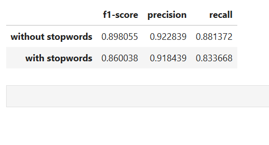
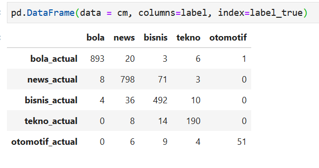
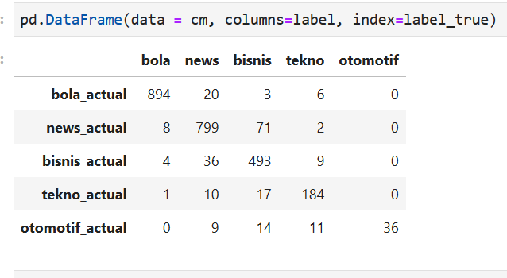

# Indonesian News Dataset

Classifying Indonesian News from a super imbalance dataset.

The dataset can be downloaded [here](https://drive.google.com/open?id=1sCF0gNg5sFseZFD5LGJzdh5qzaMIv7Ip)

train label distribution | test label distribution
---|---
 | 

Baseline score using Multinomial Naive Bayes

Confusion Matrix
No Stopwords | Using Stopwords
---|---
 | 